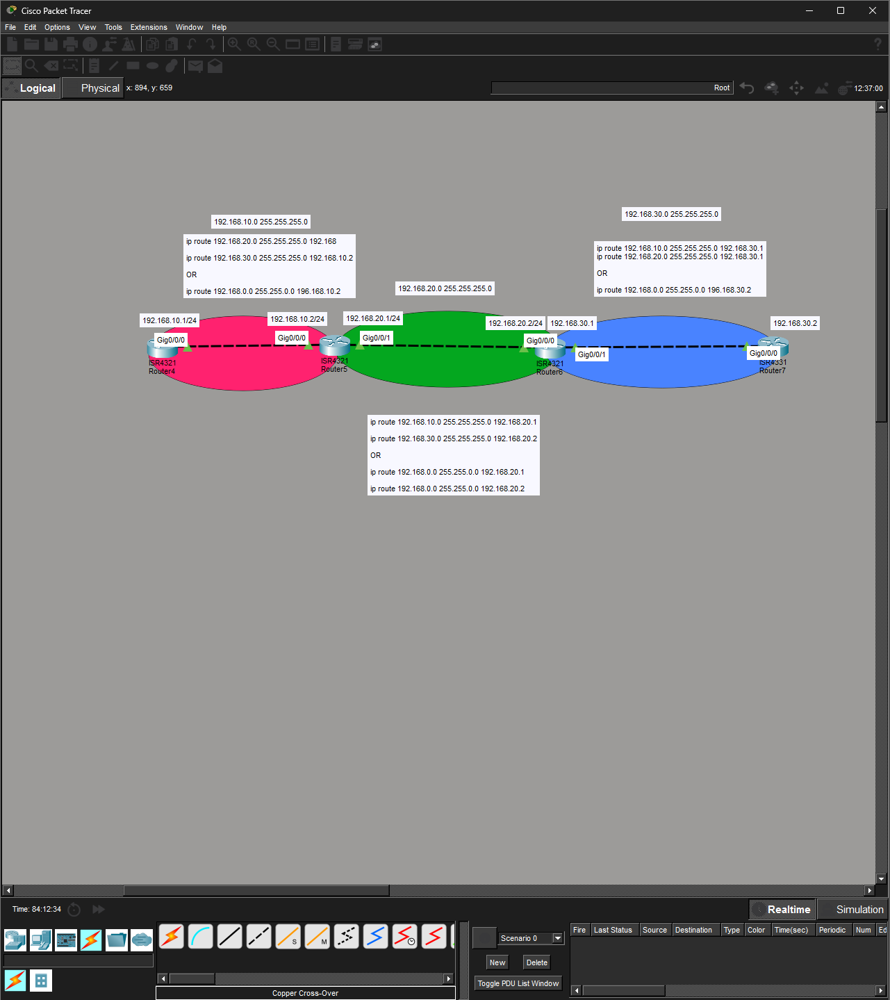

# Lab 06 — Static Route Summarization Across a Four-Router Chain

**Date:** 2026-07-24 / 2026-07-25 (two sessions)
**Platform:** Cisco Packet Tracer 8.x — 3x ISR 4321 (R4–R6), 1x ISR 4331 (R7), IOS 15.4
**Time spent:** ~2 hrs across two days
**Status:** Complete — end-to-end reachability verified before and after summarization

---

## Objective

Build a four-router linear chain and provide full any-to-any reachability using static routes only. Then refactor the routing tables: replace the multiple specific /24 routes on each router with a single summarized route, and confirm connectivity is unchanged.

Success criteria:

1. Every router reaches every non-connected network.
2. Each pair of directly connected routers can ping across their shared link.
3. The two end routers (R4 and R7) can reach each other end-to-end.
4. After summarization, all of the above still holds with one static route per router instead of two.

The topology is a chain, not a hub — this matters, and the "Key takeaways" section explains why it's exactly the shape where one summary per router is sufficient.

---

## Topology

```
  192.168.10.0/24      192.168.20.0/24      192.168.30.0/24
                 .2  .1              .2  .1
 [ R4 ]──────────[ R5 ]──────────[ R6 ]──────────[ R7 ]
   .1   G0/0/0    G0/0/1   G0/0/0   G0/0/1   G0/0/0  .2
        G0/0/0            G0/0/0            G0/0/0
```

- R4 — left endpoint, one interface, one neighbor (R5)
- R5 — middle, two interfaces (to R4 and R6)
- R6 — middle, two interfaces (to R5 and R7)
- R7 — right endpoint, one interface, one neighbor (R6)



---

## Addressing table

| Device | Interface | IP address    | Mask          | Connects to |
|--------|-----------|---------------|---------------|-------------|
| R4     | G0/0/0    | 192.168.10.1  | 255.255.255.0 | R5          |
| R5     | G0/0/0    | 192.168.10.2  | 255.255.255.0 | R4          |
| R5     | G0/0/1    | 192.168.20.1  | 255.255.255.0 | R6          |
| R6     | G0/0/0    | 192.168.20.2  | 255.255.255.0 | R5          |
| R6     | G0/0/1    | 192.168.30.1  | 255.255.255.0 | R7          |
| R7     | G0/0/0    | 192.168.30.2  | 255.255.255.0 | R6          |

**Starting state:** R6 G0/0/1 and R7 G0/0/0 were unconfigured and shut down. The 192.168.30.0/24 link did not exist until those interfaces were addressed and brought up — the first physical-layer task, before any routing.

**What each router already knows (connected, no route needed):**

| Router | Directly connected | Must be reached via static route |
|--------|--------------------|----------------------------------|
| R4     | .10.0              | .20.0, .30.0                     |
| R5     | .10.0, .20.0       | .30.0                            |
| R6     | .20.0, .30.0       | .10.0                            |
| R7     | .30.0              | .10.0, .20.0                     |

---

## Configuration

### Phase 0 — bring up the missing links

R6:

```
enable
configure terminal
 interface GigabitEthernet0/0/1
  ip address 192.168.30.1 255.255.255.0
  no shutdown
```

R7:

```
enable
configure terminal
 interface GigabitEthernet0/0/0
  ip address 192.168.30.2 255.255.255.0
  no shutdown
```

Line protocol comes up on both, and 192.168.30.0/24 appears as a connected (C) route on each.

### Phase 1 — specific static routes

Each router gets one route per non-connected network. The next hop is always the neighbor's interface on the shared link.

R4 (reach everything to its right, all via R5):

```
 ip route 192.168.20.0 255.255.255.0 192.168.10.2
 ip route 192.168.30.0 255.255.255.0 192.168.10.2
```

R5 (only .30.0 is missing, via R6):

```
 ip route 192.168.30.0 255.255.255.0 192.168.20.2
```

R6 (only .10.0 is missing, via R5):

```
 ip route 192.168.10.0 255.255.255.0 192.168.20.1
```

R7 (reach everything to its left, all via R6):

```
 ip route 192.168.10.0 255.255.255.0 192.168.30.1
 ip route 192.168.20.0 255.255.255.0 192.168.30.1
```

At this point full end-to-end connectivity works. R4 can reach R7's 192.168.30.1, and R7 can reach R4's 192.168.10.1.

### Phase 2 — collapse to a single summary route

The three LANs — 192.168.10.0/24, 192.168.20.0/24, 192.168.30.0/24 — all sit inside 192.168.0.0/16. So on each router the specific routes can be removed and replaced with one aggregate pointing the same direction.

Remove the specific routes (must match address + mask exactly):

```
 no ip route 192.168.20.0 255.255.255.0
 no ip route 192.168.30.0 255.255.255.0
```

Then add the summary. Each router points its summary toward the rest of the network:

```
R4:  ip route 192.168.0.0 255.255.0.0 192.168.10.2   ! toward R5
R5:  ip route 192.168.0.0 255.255.0.0 192.168.20.2   ! toward R6
R6:  ip route 192.168.0.0 255.255.0.0 192.168.20.1   ! toward R5
R7:  ip route 192.168.0.0 255.255.0.0 192.168.30.1   ! toward R6
```

The routing table now shows a single `S 192.168.0.0/16 [1/0] via ...` entry, and connectivity is identical to Phase 1.

**Why the local LANs don't break:** the /16 summary technically includes each router's own connected /24, but the router still prefers the connected route because of **longest-prefix match** — a /24 is more specific than a /16, so it always wins for local traffic. The summary only catches destinations that have no more-specific match.

### Persist (add to your reflex checklist — not done in session)

```
end
copy running-config startup-config
```

---

## Verification

Reading ping output character-by-character mattered more in this lab than raw success rate, because three different result characters appeared and they mean different things:

| Char | Meaning | Implies |
|------|---------|---------|
| `!`  | Echo reply received | success |
| `.`  | Timed out, no reply | silent drop — often a missing **return** route, or ARP not yet resolved |
| `U`  | ICMP "destination unreachable" received | a router **on the path** has no route and said so explicitly |

Examples from the run:

R4 → R7's LAN, once summarization and return paths were all in place:

```
R4#ping 192.168.30.1
!!!!!
Success rate is 100 percent (5/5)
```

R4 → 192.168.30.1 *before* the far routers had their return routes:

```
U.U.U
Success rate is 0 percent (0/5)
```

The `U` (not `.`) is the tell: a downstream router received the packet and actively reported it had no route back — a return-path gap, not a forward-path or cabling problem.

Benign first-packet drop, seen repeatedly (`.!!!!` = 4/5 = 80%):

```
R7#ping 192.168.10.1
.!!!!
Success rate is 80 percent (4/5)
```

The single leading `.` is just the first packet waiting on ARP resolution; packets 2–5 succeed. This is normal and is **not** a fault — distinguishing it from a real 1/5 loss pattern is the skill.

Final routing table, R7 (summarized):

```
Gateway of last resort is not set
S    192.168.0.0/16 [1/0] via 192.168.30.1
     192.168.30.0/24 is variably subnetted, 2 subnets, 2 masks
C       192.168.30.0/24 is directly connected, GigabitEthernet0/0/0
L       192.168.30.2/32 is directly connected, GigabitEthernet0/0/0
```

One static entry replacing the two it had in Phase 1.

---

## Troubleshooting log

| # | Symptom | Actual cause | Fix |
|---|---------|--------------|-----|
| 1 | R6 G0/0/1 / R7 G0/0/0 had no IP; .30.0 link dead | Interfaces unconfigured and shut | Address them + `no shutdown` |
| 2 | R7: `ip route 192.168.10.0 ... 192.168.10.2` accepted but useless | Next hop 192.168.10.2 is **not adjacent** to R7 — it's R5's interface two hops away, unreachable from R7 | Re-point via the real neighbor: `... 192.168.30.1` (R6) |
| 3 | R7: `no ip route 192.168.10.0 255.255.255.0 192.168.30.1` → `%No matching route to delete` | Tried to delete a route by a next hop that didn't match the one actually installed (.10.2) | Delete by matching prefix/mask (next hop optional): `no ip route 192.168.10.0 255.255.255.0` |
| 4 | R7: `no ip route 192.168.10.20 255.255.255.0` → `%Inconsistent address and mask` | 192.168.10.20 isn't a valid network address for a /24 — host bits are set | Use the network address 192.168.10.0 |
| 5 | R5: `%IP-4-DUPADDR: Duplicate address 192.168.20.1 on G0/0/1, sourced by 0006.2A28.C701` | Another device on the .20.0 segment was briefly using 192.168.20.1 during setup | Transient — resolved once addressing settled; the MAC identifies the offender if it recurs |
| 6 | R4→30.1 returns `U.U.U` | Return route not yet configured on far routers | Add the missing routes on R6/R7; retest → 100% |
| 7 | `ping` / `show ip route` rejected inside config mode (`% Invalid input at ^`) | EXEC commands don't run in config mode | Prefix with `do`, e.g. `do ping`, `do show ip route` |
| 8 | `config` then answering `y` → `?Must be "terminal", "memory" or "network"` | Bare `config` prompts for a source | Use `config t` (`configure terminal`) |
| 9 | Typos: `not shutdown`, `piong`, incomplete `ip route ... 192.168` | Fat-finger / partial commands | Corrected: `no shutdown`, `ping`, full next-hop octet |

---

## Key takeaways

**Summarization is just longest-prefix match run in reverse.** Multiple contiguous networks that share a common prefix can be advertised as one shorter-prefix route. Here 10.0, 20.0, 30.0 all live under 192.168.0.0/16, so one /16 route does the work of three /24s. The router still uses connected /24s for local delivery because a longer prefix always beats a shorter one.

**A summary can be looser than necessary and still work.** 192.168.0.0/16 covers the whole 192.168.x.x space — far more than the three /24s in use. It works, but it's not the *tightest* aggregate (see next steps). Loose vs. tight is a deliberate trade-off, not an accident.

**The chain topology is what makes one-summary-per-router valid.** Each router has exactly one direction full of non-connected networks: R4 and R7 point inward, R5 and R6 each point at their single non-local neighbor. In a hub-and-spoke or any topology where a router must reach different networks through *different* neighbors, a single catch-all summary would send some traffic the wrong way. This design works because the topology is linear.

**Next hop means *adjacent*, every time.** R7's dead route (entry #2) is the two-router lab's `%Invalid next hop` lesson in a new disguise — no error this time, just silent uselessness. 192.168.10.2 is a real address, but it's not on any link R7 touches, so R7 can't hand a packet to it. The next hop must be reachable out a directly connected interface.

**Deleting a static route is matching, not describing.** Entries #3 and #4 are both "the router won't remove what you didn't precisely name." `no ip route` needs the same prefix and mask you installed, and the address has to be a valid network address for that mask.

**Read the ping characters, not just the percentage.** `U` ≠ `.`. An unreachable is a router talking to you; a timeout is silence. That distinction pointed straight at a return-path gap (entry #6) instead of sending me hunting through forward paths or cabling.

---

## Open questions / next steps

- **Tightest summary:** 192.168.0.0/16 is loose. The third octets 10, 20, 30 share only their top three bits, so 192.168.0.0/19 (255.255.224.0) is the smallest single aggregate that still covers all three (it spans third-octet 0–31). Redo the lab with /19 and confirm identical behavior with a tighter block.
- **The loose-summary loop:** because R5's /16 points at R6 and R6's /16 points back at R5, a packet for an *unused* address inside 192.168.0.0/16 (say 192.168.99.1) would bounce R5↔R6 until its TTL expires. The three real networks are fine, but this is the concrete downside of over-summarizing. Worth demonstrating with a `tracert` to a nonexistent host in-range.
- **Add a default route** at R4 and R7 toward a simulated ISP and watch how gateway-of-last-resort interacts with the /16 summary.
- **Convert to OSPF** and compare: dynamic routing would advertise these networks automatically and adapt to a downed link, where these static summaries would blackhole traffic.
- **Save configs** with `copy run start` on all four so the lab survives a reload.

---

## Files

- `topology.png` — four-router chain with per-segment route annotations
- `configs/` — annotated `show running-config` from R4, R5, R6, R7
- `verification/` — ping and `show ip route` captures, Phase 1 and Phase 2
- `lab.pkt` — Packet Tracer source