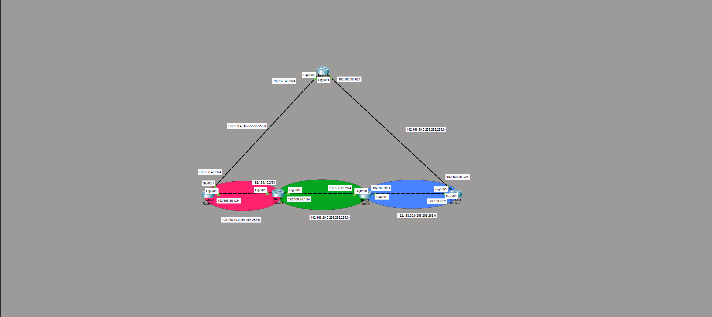

# Lab 07 — Dynamic Routing with OSPF (Five Routers, Redundant Paths)

**Date:** August 5–7, 2026
**Platform:** Cisco Packet Tracer 8.x — 4x ISR 4321 (R4–R6, R8), 1x ISR 4331 (R7), IOS 15.4
**Time spent:** ~2 hrs
**Status:** Complete — full reachability, load balancing, and failover all verified

---

## Objective

Take the four-router chain from Lab 06, add a fifth router (R8) across the top to create a **redundant loop**, and replace hand-written static routes with **OSPF** so the routers discover all paths automatically. Then prove the two things static routing could not do: use multiple equal-cost paths at once, and reroute automatically when a link fails.

Success criteria:

1. Every router reaches every network without a single static route.
2. Where two equal-cost paths exist, OSPF installs and uses both.
3. When a link is cut, traffic reroutes over the surviving path with no manual change.

---

## Topology

The chain from Lab 06, closed into a loop by R8 sitting on top and connecting to both ends.

```
                         [ R8 ]
              .40.2  Gi0/0/0    Gi0/0/1  .50.1
             /                             \
   192.168.40.0/24                   192.168.50.0/24
           /                                 \
     .40.1                                     .50.2
   [ R4 ]───────[ R5 ]───────[ R6 ]───────[ R7 ]
        .10  .10/.20  .20/.30  .30/.50(via R8)
         └─ .10.0 ─┘└─ .20.0 ─┘└─ .30.0 ─┘
```

Two paths now exist between the ends: the **chain** (R4-R5-R6-R7) and the **top** (R4-R8-R7). This redundancy is the entire point of the lab.



---

## Addressing table

| Link | Network | Router (int) | Router (int) |
|------|---------|--------------|--------------|
| R4–R5 | 192.168.10.0/24 | R4 .1 (G0/0/0) | R5 .2 (G0/0/0) |
| R5–R6 | 192.168.20.0/24 | R5 .1 (G0/0/1) | R6 .2 (G0/0/0) |
| R6–R7 | 192.168.30.0/24 | R6 .1 (G0/0/1) | R7 .2 (G0/0/0) |
| R4–R8 | 192.168.40.0/24 | R4 .1 (G0/0/1) | R8 .2 (G0/0/0) |
| R7–R8 | 192.168.50.0/24 | R8 .1 (G0/0/1) | R7 .2 (G0/0/1) |

New in this lab: R4 G0/0/1 (192.168.40.1), R7 G0/0/1 (192.168.50.2), and all of R8. These are the links that close the loop.

---

## Configuration

### Step 1 — bring up the two new links

R8 (new router, both interfaces):

```
enable
configure terminal
 hostname R8
 interface GigabitEthernet0/0/0
  ip address 192.168.40.2 255.255.255.0
  no shutdown
 interface GigabitEthernet0/0/1
  ip address 192.168.50.1 255.255.255.0
  no shutdown
```

R4 and R7 each get their new interface toward R8 (192.168.40.1 and 192.168.50.2). Directly connected pings confirm the physical links before touching routing.

### Step 2 — enable OSPF on every router

Instead of writing a route per destination, OSPF is told which of its own interfaces to run on, and it discovers everything else by talking to neighbors. Every router got the same five-line block:

```
router ospf 1
 network 192.168.10.0 0.0.0.255 area 0
 network 192.168.20.0 0.0.0.255 area 0
 network 192.168.30.0 0.0.0.255 area 0
 network 192.168.40.0 0.0.0.255 area 0
 network 192.168.50.0 0.0.0.255 area 0
```

- `ospf 1` is the process ID (locally significant, doesn't have to match between routers — but keeping it consistent is good practice).
- `0.0.0.255` is a **wildcard mask** — the inverse of a subnet mask. `0.0.0.255` means "match the first three octets, any value in the last." It tells OSPF which interfaces belong to the process.
- `area 0` is the backbone area. A single-area design keeps this lab simple.

Neighbors form automatically, shown by the log messages:

```
%OSPF-5-ADJCHG: Process 1, Nbr 192.168.50.1 on GigabitEthernet0/0/1 from LOADING to FULL, Loading Done
```

`FULL` is the goal state — it means two routers have exchanged their full link-state databases and agree on the map of the network.

### Step 3 — simplify the five network statements into one

The five `network` lines all share the 192.168 prefix, so they collapse into a single wildcard statement covering the whole range:

```
no router ospf 1
router ospf 1
 network 192.168.0.0 0.0.255.255 area 0
```

`0.0.255.255` matches "192.168.anything.anything" — one line advertising all five networks. This is the OSPF equivalent of the route summarization from Lab 06: the same aggregation idea applied to the `network` statement instead of a static route. Adjacencies re-formed identically and connectivity was unchanged.

### Step 4 — persist

```
end
copy running-config startup-config
```

Done on every router this time — the reflex is forming.

---

## Verification — the three things that make OSPF worth it

### 1. Full reachability, zero static routes

From R4, pinging the far end and every hop between — all 100%:

```
R4#ping 192.168.30.1   →  !!!!!  (5/5)
R4#ping 192.168.50.2   →  !!!!!  (5/5)
```

The routing table shows `O` (OSPF-learned) entries for every network R4 isn't directly on — none of which were typed by hand.

### 2. Equal-cost load balancing (static routing cannot do this)

R4's table shows **two entries for the same destination**, both selected:

```
O  192.168.30.0/24 [110/3] via 192.168.10.2, GigabitEthernet0/0/0
                   [110/3] via 192.168.40.2, GigabitEthernet0/0/1
```

Both paths to 192.168.30.0 cost the same (`[110/3]`), so OSPF installed both and load-balances across them — one route through the chain (via R5), one over the top (via R8). A static route can only ever point one direction.

**Reading the numbers:** `110` is OSPF's administrative distance (how trustworthy the source is). The second number is **cost**, which rises with each hop — `[110/2]` is one router away, `[110/3]` is two. It's the dynamic-routing version of reading TTL to count hops.

### 3. Automatic failover (the headline result)

With everything up, R4 → 192.168.30.1 succeeds over the chain. Then R5's link toward R6 was deliberately cut:

```
R5(config)#int g0/0/1
R5(config-if)#shutdown
%OSPF-5-ADJCHG: Process 1, Nbr 192.168.30.1 ... from FULL to DOWN, Neighbor Down: Interface down or detached
```

The chain is now severed. Re-testing from R4:

```
## After R5 g0/0/1 was shutdown
R4#ping 192.168.30.1
!!!!!
Success rate is 100 percent (5/5)
```

**Still 5/5.** OSPF detected the dead neighbor, recalculated, and rerouted traffic over the top through R8 — with no configuration change from me. This one test is the entire argument for dynamic routing over static.

### The link-state database

`show ip ospf database` on R5 lists every router's advertisements (Router Link States) and every shared segment (Net Link States). This is the shared "map" all five routers agree on — the thing that lets any router compute its own best paths. Seeing all five router IDs in the database confirms the topology fully converged.

---

## Troubleshooting log

| # | Symptom | Cause | Fix |
|---|---------|-------|-----|
| 1 | `hostname R8` rejected at `Router#` with `% Invalid input at ^` | Ran a config command from privileged EXEC, not config mode | `config t` first |
| 2 | `ping` / `show ip ospf` rejected in config mode | EXEC commands need config-mode prefix | `do ping`, `do show ip ospf` |
| 3 | `do show ospf neighbour` → `% Invalid input at ^` | Wrong syntax (and British spelling) — the command is `show ip ospf neighbor` | Use correct keyword order and spelling |
| 4 | `network 192.168.0.0 0.0.255.255` → `% Incomplete command` | Missing the `area` keyword | Append `area 0` |
| 5 | `ping 192.168` → `Translating "192.168"... % Unrecognized host` | Typed an incomplete address; IOS tried to DNS-resolve it as a hostname | Type the full IP |
| 6 | First ping of a series shows `.!!!!` (4/5) | First packet waits on ARP — normal, not a fault | Ignore; packets 2–5 succeed |
| 7 | Leftover `ip route 192.168.0.0 255.255.0.0 ...` static summaries from Lab 06 | Carried over from the previous lab on the same devices | `no ip route ...` on each; let OSPF own all routing |

---

## Key takeaways

**Dynamic routing trades typing for intelligence.** In Lab 06 I wrote a route for every destination on every router. Here I told each router only about its *own* interfaces, and OSPF worked out all the paths by exchanging maps with neighbors. Add a network and it propagates automatically; lose a link and it reroutes automatically. That adaptivity is the whole reason protocols like OSPF exist.

**Redundancy only pays off with a protocol that can use it.** The R8 loop gave the network a second path, but a second path is useless if nothing knows to use it. OSPF turned that physical redundancy into real resilience — load balancing while healthy, failover when broken. Static routes over the same topology would have sat there doing nothing until I manually re-pointed them.

**`FULL` is the word to look for.** OSPF adjacencies climb through states (DOWN → LOADING → FULL). `FULL` means two routers have fully synchronized their databases. When something isn't reachable, "which neighbors are FULL?" is the first question — a neighbor stuck below FULL is where the problem lives.

**The metric encodes distance.** `[110/2]` vs `[110/3]` tells you how far away a network is in OSPF's eyes. When two paths show the *same* cost, both get used; when they differ, the lower wins. Reading the cost is how you predict the path a packet will take without tracing it.

**OSPF's `network` statement summarizes the same way a static route does.** Collapsing five `network` lines into `network 192.168.0.0 0.0.255.255 area 0` is the same aggregation logic as Lab 06's `/16` static summary — just expressed as a wildcard mask instead of a subnet mask. The concept transfers directly.

---

## Open questions / next steps

- **Manipulate path selection** by changing interface cost (`ip ospf cost`) or bandwidth, and watch a `[110/3]` path become preferred over a `[110/2]` one — proving the metric drives the decision.
- **Time the failover** with a continuous ping during the link cut to see how many packets (if any) drop during reconvergence.
- **Multi-area OSPF:** split this into area 0 + area 1 with an ABR, and observe how inter-area routes (`O IA`) appear differently from intra-area ones.
- **Compare against Lab 06:** the same physical topology under static vs. OSPF — a strong side-by-side write-up on when each is the right tool.

---

## Files

- `topology.png` — five-router redundant topology
- `configs/` — `show running-config` from R4–R8
- `verification/` — ping tests, `show ip route`, `show ip ospf database`, and the failover capture
- `lab.pkt` — Packet Tracer source