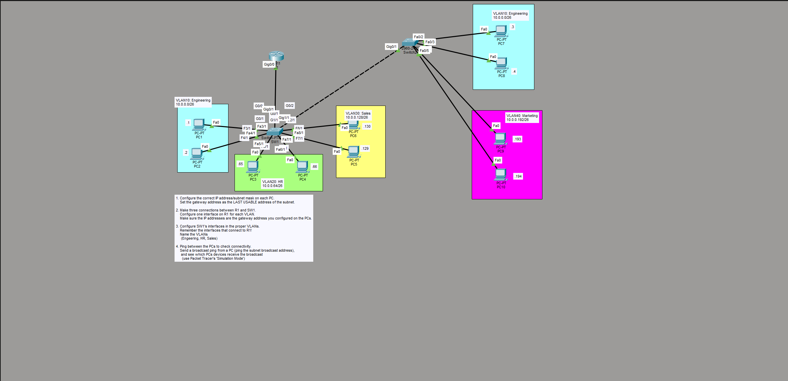

# Lab 08 — VLANs, Trunking, and Inter-VLAN Routing (Router-on-a-Stick)

**Date:** August 7, 2026
**Platform:** Cisco Packet Tracer 8.x — 1x router (R1), 2x switches (SW1, SW2), 8 PCs, IOS 15.4
**Time spent:** ~2.5 hrs
**Status:** Complete — segmentation, trunking, and inter-VLAN routing all verified

---

## Objective

Segment a single physical network into four departments using VLANs across two switches, carry all four VLANs over trunk links, and use one router to route between them (router-on-a-stick). The addressing is a subnetting exercise in itself: one `/24` split into four `/26` subnets, with each VLAN's gateway set to the **last usable address** of its subnet.

Success criteria:

1. Each PC has a correct `/26` address and gateway; devices in the same VLAN can reach each other.
2. VLANs are carried between switches and to the router over 802.1Q trunks.
3. Devices in *different* VLANs can reach each other through the router.

---

## Topology

```
                         R1 (router-on-a-stick)
                          │  g0/0 trunk, subinterfaces .10 .20 .30 .40
                          │ 802.1Q
                    ┌─────┴─────┐
        trunk ......│    SW1    │...... trunk (Gig0/1)
                    └──┬──┬──┬──┘
              VLAN10  VLAN20 VLAN30
              PC1 PC2 PC3 PC4 PC5 PC6
                    ┌───────────┐
                    │    SW2    │
                    └──┬─────┬──┘
                  VLAN10     VLAN40
                  PC7 PC8    PC9 PC10
```

Two switches so VLANs must span a switch-to-switch trunk; one router carrying all four VLANs on subinterfaces over a single trunk to SW1.



---

## Addressing — one /24 split into four /26 subnets

A `/26` mask (255.255.255.192) gives blocks of 64 addresses. Gateway = **last usable** = (broadcast − 1).

| VLAN | Name | Subnet /26 | Usable range | Broadcast | Gateway (R1 subif) |
|------|------|------------|--------------|-----------|--------------------|
| 10 | Engineering | 10.0.0.0/26 | .1 – .62 | .63 | **10.0.0.62** |
| 20 | HR | 10.0.0.64/26 | .65 – .126 | .127 | **10.0.0.126** |
| 30 | Sales | 10.0.0.128/26 | .129 – .190 | .191 | **10.0.0.190** |
| 40 | Marketing | 10.0.0.192/26 | .193 – .254 | .255 | **10.0.0.254** |

PCs: Engineering PC1–PC4 (.1–.4), HR PC3–PC4 (.65–.66), Sales PC5–PC6 (.129–.130), Marketing PC9–PC10 (.193–.194). All use mask 255.255.255.192.

---

## Configuration

### Step 1 — create VLANs and assign access ports (SW1)

Ports facing PCs are **access** ports — they belong to exactly one VLAN and carry untagged traffic to the host. Assigning a port to a VLAN that doesn't exist yet auto-creates it:

```
interface range fastEthernet 3/1, 4/1
 switchport mode access
 switchport access vlan 10          ! % Access VLAN does not exist. Creating vlan 10
interface range fastEthernet 5/1, 6/1
 switchport mode access
 switchport access vlan 20
interface range fastEthernet 7/1, 8/1
 switchport mode access
 switchport access vlan 30
```

Then name them (a separate step, done in VLAN config mode, not interface mode):

```
vlan 10
 name Engineering
vlan 20
 name HR
vlan 30
 name Sales
vlan 40
 name Marketing
```

`show vlan brief` confirms which ports landed in which VLAN.

### Step 2 — trunk the links (SW1↔SW2 and SW1↔R1)

Access ports carry one VLAN; a **trunk** carries many, tagging each frame with its VLAN ID (802.1Q) so the other end knows where it belongs. The switch-to-switch and switch-to-router links must be trunks:

```
interface gigabitEthernet 0/1
 switchport mode trunk
 switchport trunk allowed vlan 10,20,30,40
```

`show interfaces trunk` confirms `Encapsulation 802.1q`, `Status trunking`, and the allowed-VLAN list.

### Step 3 — change the native VLAN

The native VLAN carries untagged frames on a trunk and defaults to VLAN 1. Moving it off VLAN 1 to an unused ID is a security hardening step (mitigates VLAN-hopping):

```
interface range gigabitEthernet 0/1, 1/1
 switchport trunk native vlan 1001
```

### Step 4 — router-on-a-stick (R1)

The router first had three physical interfaces with IPs, then those were removed and replaced with **subinterfaces** on a single trunked interface — one logical interface per VLAN, each tagged and holding that VLAN's gateway address:

```
interface gigabitEthernet 0/0.10
 encapsulation dot1Q 10
 ip address 10.0.0.62 255.255.255.192
interface gigabitEthernet 0/0.20
 encapsulation dot1Q 20
 ip address 10.0.0.126 255.255.255.192
interface gigabitEthernet 0/0.30
 encapsulation dot1Q 30
 ip address 10.0.0.190 255.255.255.192
interface gigabitEthernet 0/0.40
 encapsulation dot1Q 40
 ip address 10.0.0.254 255.255.255.192
```

`encapsulation dot1Q 10` is what ties subinterface `.10` to VLAN 10's tagged traffic. One physical link now routes between all four VLANs — hence "router-on-a-stick."

### Step 5 — SW2

Same pattern: access ports for VLAN 10 (PC7, PC8) and VLAN 40 (PC9, PC10), named VLANs, and a trunk back to SW1 allowing 10 and 40.

---

## Verification

### Same-VLAN vs. cross-VLAN — read the TTL

The TTL in the ping reply tells you whether the router was crossed:

Same VLAN (PC5 → PC6, both Sales) — **TTL 128**, no router hop:
```
Reply from 10.0.0.130: bytes=32 time<1ms TTL=128
```

Different VLAN (PC5 Sales → PC1 Engineering) — **TTL 127**, one hop through R1:
```
Reply from 10.0.0.1: ... TTL=128   ! (from R1's own view)
Reply from 10.0.0.65: ... TTL=127  ! cross-VLAN, decremented once by R1
```

That single decrement (128 → 127) is the proof the router-on-a-stick is doing its job. Same-VLAN traffic never touches the router; cross-VLAN traffic does, exactly once.

### Broadcast containment

The task called for a broadcast ping (to a subnet's broadcast address) observed in Simulation Mode. A broadcast stays inside its own VLAN — only devices in that VLAN receive it, which is the entire point of VLANs: they split one physical switch into separate broadcast domains.

---

## Troubleshooting log

| # | Symptom | Cause | Fix |
|---|---------|-------|-----|
| 1 | **VLAN 40 (Marketing) unreachable from every other VLAN, and vice versa** | VLAN 40 existed on SW2 and R1 had its `.40` subinterface, but **VLAN 40 was never created on SW1** — so SW1's trunk dropped VLAN 40 tagged frames | Created VLAN 40 on SW1; Marketing immediately reachable both directions (before: 100% loss, after: 5/5) |
| 2 | `switchport trunk allowed vlan 40` wiped the existing allowed list | The `allowed vlan X` form **replaces** the whole list, it doesn't append | Use `switchport trunk allowed vlan add 40` to extend the list without clearing it |
| 3 | `switchport access vlan10` → `% Invalid input at ^` | Missing space between keyword and ID | `switchport access vlan 10` |
| 4 | `name Engineering` rejected in interface-range mode | VLAN naming happens in `vlan <id>` config mode, not interface mode | Enter `vlan 10` then `name Engineering` |
| 5 | `switchport trunk encapsulation dot1q` → `% Invalid input` on SW2 | This switch model only supports 802.1Q, so the encapsulation command isn't available (nothing to choose) | Skip it; go straight to `switchport mode trunk` |
| 6 | `switchport trunk remove vlan 30` → `% Invalid input` | Wrong keyword order | `switchport trunk allowed vlan remove 30` |
| 7 | `R1#int g0/0/1` / `int g0/0/0` → invalid interface | Wrong interface naming for this router; also ran from privileged EXEC not config mode | `config t`, then `int g0/0` |
| 8 | First packet of a ping series times out (e.g. 3/4 to .129) | ARP resolving on the first packet — normal | Ignore; subsequent packets succeed |

**Entry #1 is the headline.** It's a clean end-to-end troubleshoot: symptom (one VLAN unreachable), method (tracert + Simulation Mode to isolate where frames died), root cause (a VLAN missing on one switch in the path), fix, and a verified before/after. A trunk only carries VLANs that exist on *both* ends — a VLAN defined on one switch but not the other is silently dropped at the gap.

---

## Key takeaways

**VLANs split one physical switch into many logical networks.** Each VLAN is its own broadcast domain and its own subnet. Ports facing hosts are *access* ports (one VLAN, untagged); ports between switches or to a router are *trunks* (many VLANs, 802.1Q-tagged). Getting the access/trunk distinction right is most of VLAN configuration.

**A trunk only carries what exists on both ends.** The VLAN 40 outage (troubleshooting #1) is the lesson in one sentence: defining a VLAN on one switch and its access ports, but forgetting it on the switch in the path, means the trunk drops those frames and that VLAN goes dark. When one VLAN is unreachable but others work, check that the VLAN exists — and is allowed on the trunk — everywhere along the path.

**`allowed vlan` replaces; `allowed vlan add` appends.** (Troubleshooting #2.) Re-running `switchport trunk allowed vlan X` silently overwrites the whole allowed list. On a production trunk carrying live VLANs, that command would cut every VLAN except the one you just typed. Reach for `add` / `remove` to modify a list, and only use the bare form to define it fresh.

**Router-on-a-stick routes many VLANs over one link with subinterfaces.** Instead of one physical router port per VLAN, one trunked port carries all of them, split into subinterfaces (`g0/0.10`, `.20`, ...). Each subinterface tags with `encapsulation dot1Q <vlan>` and holds that VLAN's gateway IP. It's the efficient way to do inter-VLAN routing with a single router interface.

**TTL confirms the routing boundary.** Same-VLAN pings come back at TTL 128 (no router crossed); cross-VLAN pings at 127 (one hop through R1). Reading that one number verifies the inter-VLAN routing is working — the same TTL-reading habit from the routing labs, applied to switching.

**Subnetting is the quiet foundation.** Before any VLAN command, the `/24`-into-four-`/26` plan had to be right, with each gateway placed at the last usable address. A wrong mask or gateway would have looked like a VLAN/trunk problem later. Get the addressing correct first.

---

## Open questions / next steps

- **Layer-3 switch** instead of router-on-a-stick: move inter-VLAN routing onto a multilayer switch with SVIs (`interface vlan 10`) and compare — no trunk bottleneck to a single router port.
- **VTP** to propagate VLANs between switches automatically, so the VLAN 40 outage (defining it on one switch only) couldn't happen.
- **Harden the access layer:** `switchport port-security`, shut unused ports, and confirm the native-VLAN change actually blocks a VLAN-hopping attempt in Simulation Mode.
- **DHCP per VLAN** from R1 so hosts get addresses automatically instead of static assignment.

---

## Files

- `topology.png` — two-switch, four-VLAN topology with the task sheet
- `configs/` — `show running-config` from R1, SW1, SW2; plus `show vlan brief` and `show interfaces trunk`
- `verification/` — same-VLAN and cross-VLAN ping tests, and the VLAN 40 before/after captures
- `lab.pkt` — Packet Tracer source